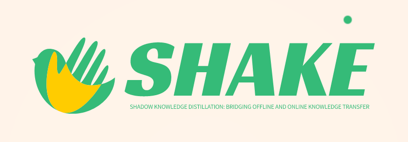
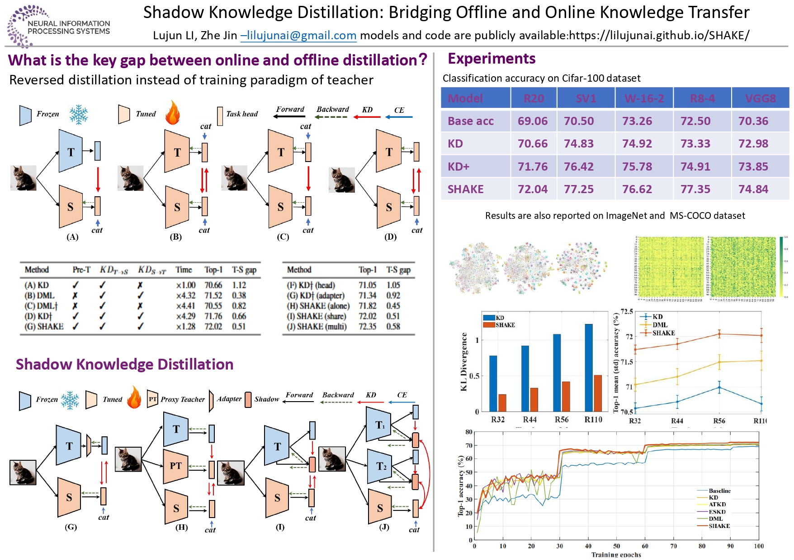

## Shadow Knowledge Distillation



### Shadow Knowledge Distillation: Bridging Offline and Online Knowledge Transfer

[paper](https://github.com/lilujunai/SHAKE), [code](https://github.com/lilujunai/SHAKE/tree/gh-pages/shake), [Training logs & model](https://pan.baidu.com/s/1hXe6iTCFw8nD_heDpCh1ag) (shak), [Poster](https://github.com/lilujunai/SHAKE/blob/gh-pages/poster/shake-poster.jpg), [video](https://github.com/lilujunai/SHAKE/blob/gh-pages/poster/shake-video.mp4), 




### Bibtex 


```markdown

@inproceedings{li2022shake,
  author    = {Lujun Li and Jin Zhe},
  title     = {Shadow Knowledge Distillation: Bridging Offline and Online Knowledge Transfer},
  booktitle = {Thirty-sixth Conference on Neural Information Processing Systems (NeurIPS)},
  year      = {2022}
}


```


### Support or Contact

lilujunai@gmail.com
